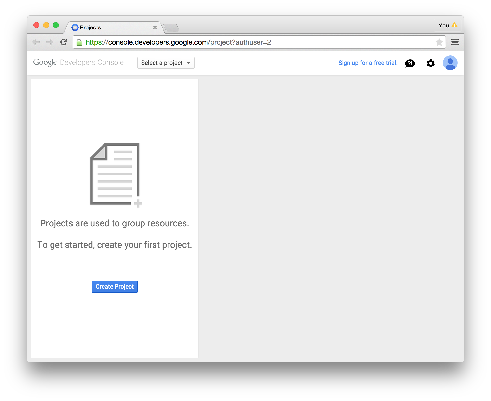

# (quick and dirty) Google Identity HOWTO

The full documentation for using Google's OpenID Connect service is [here](https://developers.google.com/identity/protocols/OpenIDConnect).  Most of that documentation is a reiteration of how OIDC/OAuth2 flows work, and how to implement them for maximum compatibility with Google.

This set of screenshots simply walks through the first few steps on that page, outlining how to register a client (aka "OpenID Connect Relying Party" or *your beacon*) with Google's Identity Service.  Throughout I'll refer to your beacon as your "application".  These instructions are being created for the Beacon Working Group initially, but they may be applicable to other GA4GH projects.

The first step is to log into Google's developer console at [https://console.developers.google.com/](https://console.developers.google.com/)...

... and create a project to represent your application:

In order to use the Google Identity API with your application you'll need to enable it in your project.  Google has a *LOT* of APIs, so you'll need to search.

Hit the Enable button and wait a few seconds for things to get set up behind the scenes.

